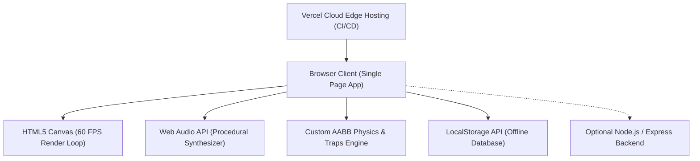

# 🎮 TRAP RUN (Level Devil)

[](https://traprun.vercel.app)
[](https://github.com/Zaitonic/traprun)
[](LICENSE)
[](public/js)
[](public/js/renderer.js)
[](public/js/audio.js)

> **A deceptive, adrenaline-pumping 2D psychological trap platformer.**  
> Inspired by *Level Devil*, every step is a gamble, every platform is a lie, and the exit door might just run away from you. Can you survive all 20 levels and escape the final boss chase?

---

## 🕹️ Live Deployment

Play right now in your browser with zero install:  
👉 **[https://traprun.vercel.app](https://traprun.vercel.app)**

---

## 📖 Table of Contents

- [Overview](#-overview)
- [Key Features](#-key-features)
- [Controls](#-controls)
- [Tech Stack Architecture](#-tech-stack-architecture)
- [Codebase Structure](#-codebase-structure)
- [Developer Guide & Extending the Game](#-developer-guide--extending-the-game)
  - [1. How Levels Work (`levels.js`)](#1-how-levels-work-levelsjs)
  - [2. How Traps Work (`traps.js`)](#2-how-traps-work-trapsjs)
  - [3. Physics & Movement Tuning (`physics.js` / `player.js`)](#3-physics--movement-tuning-physicsjs--playerjs)
  - [4. Procedural Audio Synthesis (`audio.js`)](#4-procedural-audio-synthesis-audiojs)
  - [5. Offline Leaderboard & Storage (`api.js`)](#5-offline-leaderboard--storage-apijs)
- [Local Development Setup](#-local-development-setup)
- [Deployment Workflow](#-deployment-workflow)
- [License](#-license)

---

## ⚡ Overview

**TRAP RUN** is a precision rage-platformer built from scratch with pure web standards. Unlike standard platformers, TRAP RUN subverts player expectations:
- Solid ground disappears beneath your feet.
- Ceilings drop when you jump.
- Portals and doors move away or lead into spikes.
- Spikes slide toward you right before you land.
- The game features a strict sequential 20-level progression culminating in a multi-phase boss chase with cinematic particle effects.

---

## ✨ Key Features

1. **20 Handcrafted Deceptive Levels**:
   - Sequential progression: `Level 1 → Level 2 → ... → Level 19 → Level 20`.
   - Dying restarts the *current* level only, letting players master tricky timings.
2. **Level 20 Boss Chase & Escape**:
   - A menacing mechanical boss chases the player through a collapsing obstacle course.
   - Dynamic camera shake, progressive speed ramps, and a dramatic slow-motion cinematic escape when reaching the portal.
3. **14+ Deceptive Trap Mechanisms**:
   - **Hidden Spikes**: Emerge only when the player crosses invisible trigger thresholds.
   - **Disappearing Platforms**: Crumble into particles upon contact.
   - **Gravity Inverters**: Turn the world upside-down mid-jump.
   - **Moving Exits & Fake Doors**: The goal flies away or teleports behind deadly hazards.
   - **Crusher Blocks & Falling Ceilings**: Drop rapidly when walking underneath.
   - **Phantom Grounds & False Floors**: Look solid but have zero collision.
4. **100% Procedural Audio Engine**:
   - No external `.mp3` or `.wav` files needed!
   - Built on the native Web Audio API using custom oscillator nodes, frequency sweeps, noise buffers, and ADSR gain envelopes for jumps, deaths, trap triggers, and ambient hums.
5. **Local Persistence & Competitive Mode**:
   - Built-in `localStorage` database for tracking player profiles, personal best times, run completion statistics, and fewest deaths.
   - Optional local multiplayer support for sharing turns on the same screen.
6. **Mobile Touch & Gamepad Support**:
   - On-screen touch D-Pad and jump buttons automatically activate on touch devices.

---

## 🎮 Controls

| Action | Primary (Keyboard) | Secondary | Mobile Touch |
|:---|:---|:---|:---|
| **Move Left** | `←` Left Arrow | `A` | Left Virtual D-Pad |
| **Move Right** | `→` Right Arrow | `D` | Right Virtual D-Pad |
| **Jump** | `Spacebar` | `↑` Up Arrow / `W` | Jump Button (▲) |
| **Pause Menu** | `Escape` | `P` | Menu Button on HUD |
| **Quick Restart**| `R` | — | Retry Button |

---

## 💻 Tech Stack Architecture



### 1. Frontend Core
- **Vanilla JavaScript (ES6+)**: Zero framework overhead (no React, no bundlers, no build bloat). Direct DOM and Canvas API access ensures instant load times and 60 FPS performance.
- **HTML5 Canvas API**: Custom rendering pipeline for game geometry, retro pixel-art characters, lighting gradients, camera transforms, and particle systems.
- **Modern CSS3**: Dark cyberpunk/street-fighter aesthetic with fluid animations, glowing embers, custom typography (`Inter`, `Kanit`, `Oxanium`), and responsive layouts.

### 2. Physics & Game Loop
- **Delta-Time Regulated Loop**: Uses `requestAnimationFrame` with fixed timestep integration to ensure consistent jump heights and collision accuracy across 60Hz, 120Hz, and 144Hz monitors.
- **AABB Collision Resolution**: Custom Axis-Aligned Bounding Box engine with sweep checks to eliminate tunneling through thin walls.

### 3. Audio Synthesis
- **Web Audio API**: Real-time frequency synthesis (Sine, Square, Triangle, and Sawtooth oscillators) with white noise generation for explosions and impacts. Zero audio asset download overhead.

### 4. Deployment & Hosting
- **Vercel**: Configured via `vercel.json` for static edge hosting with automatic continuous deployment on every Git push.
- **Node.js & Express (Optional)**: Includes an optional full-stack server (`server/index.js`) with an in-memory/SQLite backend (`sql.js`) for server-managed leaderboards when self-hosted.

---

## 📁 Codebase Structure

```text
traprun/
├── public/                     # Static client files (deployed to Vercel)
│   ├── index.html              # Main HTML entry point & UI overlay
│   ├── css/
│   │   └── style.css           # UI styles, animations, HUD, fonts, responsive design
│   └── js/
│       ├── main.js             # Game loop, state coordinator, scene switcher
│       ├── levels.js           # Complete level definitions (Levels 1 to 20)
│       ├── player.js           # Player entity, movement state, jump & death logic
│       ├── physics.js          # AABB collision detection & platform interaction
│       ├── traps.js            # Dynamic trap behaviors, triggers, movement logic
│       ├── boss.js             # Level 20 Boss AI, chase phases & escape cinematic
│       ├── renderer.js         # Canvas rendering pipeline, background & tile art
│       ├── particles.js        # Spark, ember, explosion, and smoke emitters
│       ├── camera.js           # Viewport tracking, smooth lerping, screen shake
│       ├── audio.js            # Procedural Web Audio API sound synthesizer
│       ├── api.js              # Offline-first storage API (localStorage DB)
│       ├── ui.js               # HUD, pause menu, leaderboard, and modal controller
│       ├── input.js            # Unified keyboard, touch, and button input handler
│       └── menu-scene.js       # Animated menu canvas background & fire effects
├── server/                     # Optional Node.js backend
│   ├── index.js                # Express web server with security headers (Helmet, CORS)
│   ├── db.js                   # SQLite database manager (sql.js)
│   └── routes/
│       └── api.js              # REST endpoints (/api/player, /api/leaderboard, etc.)
├── package.json                # Project manifest & dependency configuration
├── vercel.json                 # Vercel deployment configuration
├── .gitignore                  # Git ignore rules (node_modules, data, caches)
└── README.md                   # Project documentation & developer manual
```

---

## 🛠️ Developer Guide & Extending the Game

When developing or adding new features to TRAP RUN, keep these core architectural patterns in mind:

### 1. How Levels Work (`public/js/levels.js`)
Each level is an object inside the `LEVELS` array:
```javascript
{
  id: 1,
  name: "False Security",
  width: 960,
  height: 540,
  spawn: { x: 100, y: 440 },
  exit:  { x: 800, y: 440 },
  platforms: [
    { x: 0, y: 500, w: 960, h: 40, type: "solid" },
    { x: 300, y: 380, w: 120, h: 20, type: "crumble" }
  ],
  traps: [
    {
      type: "spike_pop",
      triggerX: 250,
      x: 320,
      y: 480,
      w: 30,
      h: 20
    }
  ]
}
```
- **Sequential Flow**: Progression is strictly sequential (`currentLevelIndex++`). Do not re-add level skip menus without preserving the default linear progression.
- **Boss Level (Level 20)**: Controlled by `public/js/boss.js`. Level 20 triggers special chase sequences and multi-stage checkpoint conditions.

### 2. How Traps Work (`public/js/traps.js`)
Traps are updated in the game loop via `TrapManager.update(dt, player)`:
- **Trigger Distances**: Many traps check `Math.hypot(player.x - trap.x, player.y - trap.y) < triggerRadius` before activating.
- **Telegraphing**: Good trap design should provide subtle psychological tells (slight vibration, faint color shift, or predictable timing) to reward attentive players.
- **Adding a New Trap**:
  1. Add trap type string to `public/js/levels.js`.
  2. Implement update/trigger logic in `public/js/traps.js`.
  3. Add rendering subroutine in `public/js/renderer.js`.
  4. Trigger appropriate audio sfx via `AudioEngine.playTrapTrigger()`.

### 3. Physics & Movement Tuning (`public/js/physics.js` / `public/js/player.js`)
Core physics constants can be tuned in `player.js`:
- `GRAVITY`: Gravitational acceleration per frame.
- `MOVE_SPEED`: Horizontal ground velocity.
- `JUMP_FORCE`: Upward impulse on jump.
- `COYOTE_TIME`: Window (in ms) allowing a jump just after stepping off a ledge.
- `JUMP_BUFFER`: Window (in ms) allowing an early jump press to trigger upon touching the ground.

### 4. Procedural Audio Synthesis (`public/js/audio.js`)
To add a new sound effect without loading an external audio file:
```javascript
function playCustomSound() {
  const ctx = AudioEngine.getAudioContext();
  const osc = ctx.createOscillator();
  const gain = ctx.createGain();

  osc.type = 'triangle'; // 'sine' | 'square' | 'sawtooth' | 'triangle'
  osc.frequency.setValueAtTime(440, ctx.currentTime);
  osc.frequency.exponentialRampToValueAtTime(110, ctx.currentTime + 0.2);

  gain.gain.setValueAtTime(0.3, ctx.currentTime);
  gain.gain.exponentialRampToValueAtTime(0.001, ctx.currentTime + 0.2);

  osc.connect(gain);
  gain.connect(ctx.destination);

  osc.start();
  osc.stop(ctx.currentTime + 0.2);
}
```

### 5. Offline Leaderboard & Storage (`public/js/api.js`)
- `API.registerPlayer(name)`: Creates or fetches a player profile in `localStorage`.
- `API.saveRun(playerId, stats)`: Saves deaths, completion time, and level reached.
- `API.getLeaderboard()`: Returns sorted runs (highest level, fewest deaths, fastest time).

---

## 🚀 Local Development Setup

### Prerequisites
- Node.js (v18 or higher recommended)
- Git

### Quick Start
```bash
# 1. Clone your repository
git clone https://github.com/Zaitonic/traprun.git
cd traprun

# 2. Install dependencies (for the optional local server)
npm install

# 3. Start the local server
npm start
```

Visit **`http://localhost:3000`** in your browser.

> **Tip**: You can also simply open `public/index.html` in any web browser or use VSCode's Live Server extension—the game runs 100% client-side!

---

## 🌐 Deployment Workflow

This project is configured for **Continuous Deployment** with Vercel:

1. **Vercel Configuration (`vercel.json`)**:
   ```json
   {
     "name": "traprun",
     "outputDirectory": "public",
     "cleanUrls": true
   }
   ```
2. **Automatic Builds**: Every time you commit and push to the `main` branch of `https://github.com/Zaitonic/traprun`, Vercel automatically deploys the updated version to:  
   **[https://traprun.vercel.app](https://traprun.vercel.app)**

```bash
# Workflow to deploy new changes:
git add .
git commit -m "Add new level / feature"
git push origin main
# Vercel will automatically build and publish live within seconds!
```

---

## 📜 License

This project is licensed under the [MIT License](LICENSE) — feel free to modify, expand, and share!
